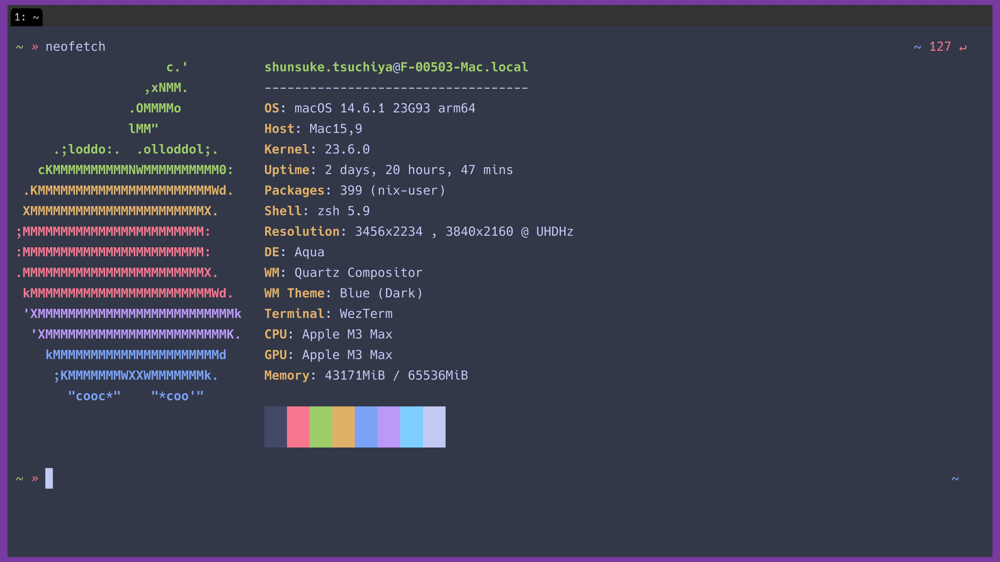
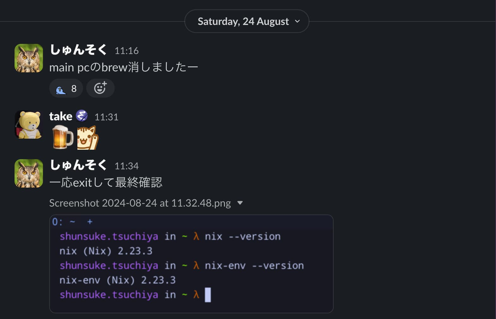

# Meet Nix!!


Nixを全く知らない男がNixをinstallする話

## Nixとの出会い。

オレは高校生エンジニア `#vim-jpのプロと繋がりたい` 新一。幼馴染で同級生の `MacOS` と `PHP カンファレンス福岡 2024` に遊びに行って、黒ずくめの男の怪しげな 登壇現場を目撃した。端末をみるのに夢中になっていた俺は、背後から近づいてきたもう１人の `@takeokunn` に気づかなかった。 俺はその男に `nix` を飲まされ、目が覚めたら・・・ `brew` をuninstallしていた！

```shell
~ » brew --version                                                                                                          ~
zsh: command not found: brew
```

先日、[PHPカンファレンス福岡2024](https://phpcon.fukuoka.jp/2024/)というイベントに行った。


自分のセッションも終わり、イベントブースも一段落したのでセッションみよーと思ってパンフレット見ていたところ、「[Nixを用いて再現可能なPHP環境を用意する](https://fortee.jp/phpcon-fukuoka-2024/proposal/fde5c43f-885e-455b-9b4f-6fdb4c697a19)」なるセッションがあることに気づきました。

お気づきの方もいるかもしれませんが、このセッションこそが、本イベントの主催者である `@takeokunn` さんのセッションでした。

僕は発表を聞いて「すげえええええええ」となった記憶があります。あとAsk the speakerに参加した。

- 当時のお仕事環境のMacのローカルにいるPython製と思しきソフトウェアのエラー吐いていて、無理やり解消していたので刺さった。
- 「何もしていないのに壊れた！」がなくなる感動を味わいたい。
- Home Brew 使っていて辛いことが解消されそうだなーーーと思っていました。

## そういえば新しいMacが来るはずだな

PHPカンファレンス福岡に参加していた時は所属が前職だったのですが、実のところ、現職の内定を承諾していました。

「あと二ヶ月で転職する」
「転職をするとどうなる?」
「知らんのか 空のMacが手に入る」

新しい環境なら、brew剥がす必要もないし、Nixを導入してみようと思いました。

### せっかくNixを入れるので

せっかく導入するので、学びたいなーと思い、AsahiさんのNixのZenn本を読んでいました。

https://zenn.dev/asa1984/books/nix-introduction/

## Meet Nix

### お仕事用のMacが届いた

新しいMacが届き、Nixを入れました。

```shell
$ sh <(curl -L https://nixos.org/nix/install)
```

[nixを入れている様子](https://x.com/shunsock/status/1823901867786822027)

neofetchした時に `nix user` と表示されるのが嬉しい。そういえば開発終了していたのでfastfetchに変えないとな...



### メインPCからbrewをuninstall

8月の後半ぐらいにメインのPCから `brew` をuninstallしました。



せっかく発表をするので[dotfiles](https://github.com/shunsock/dotfiles)の履歴を見ていたのですが、

[brewとpoetry, pyenvを引き剥がしました](https://github.com/shunsock/dotfiles/pull/10/files) というプルリクエストがあったので、多分、このあたりでやったんだと思います。

```diff
 plugins=(
     git
     bundler
-    brew
     dotenv
     macos
   )
```

実際、`$PATH`を見てもbrewがなかった。

```shell
speech (main*) » echo $PATH | grep brew
```

## そして、flake.nixへ

当初は、`nix-env` でやっていたのですが、`flake.nix` に移行しました。
自分の場合、全パッケージをアンインストールして、`flake.nix` でインストールし直しました。

```shell
$ nix-env -e '*'  # すべてのパッケージを削除
$ nix profile install .#pkg
```

## まとめ & 今後の展望

- たけてぃさんに感謝
    - 今思えば、Nixを使い始めるきっかけも、vim.jp に参加するきっかけも、meet upに登壇するきっかけも主催の @takeokunn さんでした。
    - おかげさまで今楽しいです。ありがとうございます！
- Linux環境でも動くようにしたい。
    - 最近、環境構築ツールをバイナリを出しわけしやすいGoに書き換えた。
    - 元々インタープリタ経由で動かしていたのでバイナリはええなという感想。
    - Linuxマシン買ってクロスコンパイル試したい。
- Nixをもっと知りたい。
    - 精進します！

## 自己紹介

- しゅんそく @shunsock のHNで活動しています。
- ファインディという会社でデータエンジニアをしています。
- 別件でPython製ソフトウェアを作っています。uv最高です。
- 趣味でインタープリタ作っています。
- 趣味で[CLIツール](https://github.com/shunsock/timezone_translator)作っています。
- 趣味でオフライン技術イベントの運営・手伝い・登壇をしています。

